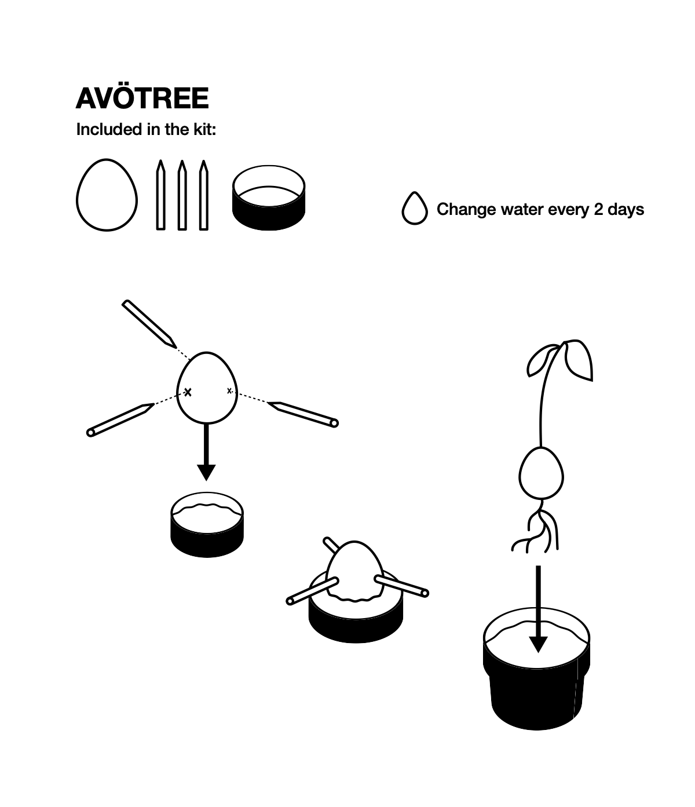
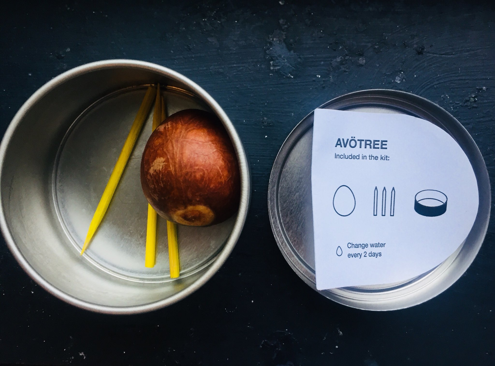
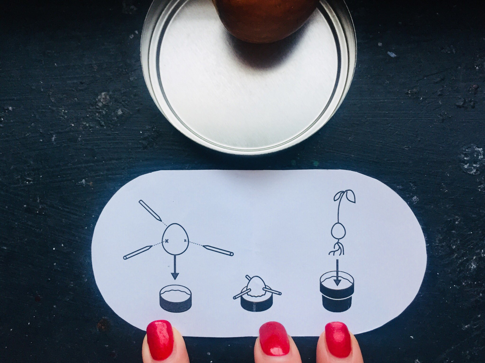

When Secret Santa comes around, I prefer a homemade approach, mostly to the disappointment of the gift-getter...

But a few years ago I got a tip that they were into trees and what's better (and cheaper for me) than growing your own.

So I created some instructions:

And made a little kit: (photos courtsey of [@KathrynParsons](https://twitter.com/KathrynParsons/status/941696052268294145)

Unfortunately an avocado tree didn't emerge, but it was the thought that counts right?

It was satisfying and fun to make a physical product. And Secret Santa is as good a trigger as any to get creative and make something new!

🥑
